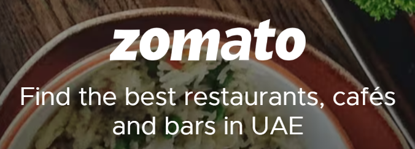
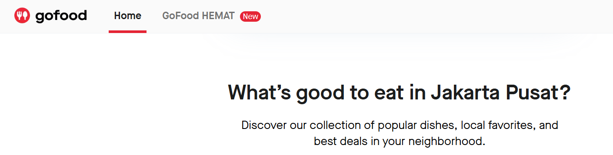
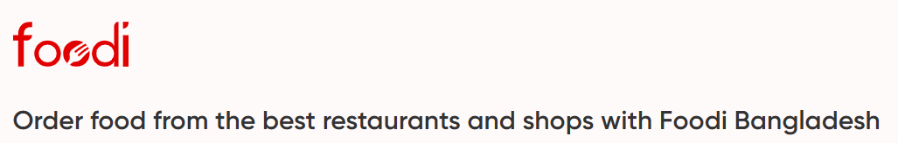

# Webscraping Production Projects

Production-focused scraping scripts for restaurant, hotel, menu, and marketplace data extraction across dynamic websites.

## Projects

| Platform | Website | Folder | Focus |
| --- | --- | --- | --- |
|  | Booking.com | `booking.com/` | Hotel listing extraction, address parsing, Excel export workflow |
|  | Talabat | `talabat/` | Scrapy, requests, Selenium, validation, menu extraction, restaurant URL collection |
|  | Hungerstation | `Hungerstation/` | Restaurant discovery, menu extraction, JSON-LD parsing, Selenium and Playwright workflows |
|  | Zomato | `Zomato/` | UAE restaurant listing extraction, menu image collection, image preparation, and multi-model vision OCR |
|  | GoFood Indonesia | `Gofood-Indonesia/` | Area-wise restaurant discovery with Playwright async scrolling and proxy-ready sessions |
|  | elmenus Cairo | `elmenus-cairo/` | Hidden API/XHR extraction for Cairo listings with location-aware request parameters |
|  | Foodi Bangladesh | `foodi-Bangladesh/` | Lat-long driven branch scraping through API requests and browser-like headers |
| Europe Bakery Ops | Multi-country Europe | `Europe/` | Country-wise bakery and cafe scraping of 45 premium websites across Denmark, Finland, France, Germany, and Sweden |
|  | Deliveroo | `deliveroo/` | Menu extraction workflow with structured JSON output |
|  | Agoda Hotels | `agoda-hotels/` | Hotel listing extraction with Playwright browser automation and Excel export |
|  | Noon Food | `noon-platform/` | Noon restaurant and menu scraping with Selenium, curl_cffi, and hidden API workflows |
| Healthcare Registry | DIMDI / German medicine portal The Federal Institute for Drugs and Medical Devices (BfArM) | `healthcare/` | Medicine product detail extraction with Playwright and BeautifulSoup, followed by structured German-to-English JSON normalization |
|  | Google Places | `google-place/` | Listing enrichment through Google Places Text Search API for address, contact details, geo-coordinates, place IDs, categories, websites, and Maps URLs |
|  | Apify Google Maps | `apify/` | Dubai F&B Google Maps extraction using Apify actors for FSR, QSR, cafes, cloud kitchens, bakeries, dessert venues, and bars |

## Tech Stack

- Python
- Scrapy
- Selenium
- Playwright
- Requests / aiohttp
- BeautifulSoup/Selectolax
- Healthcare registry scraping and structured translation mapping
- Hidden fetch/XHR API analysis
- Google Places Text Search API enrichment
- Apify actor orchestration for Google Maps datasets
- Header rotation and browser-like request profiles
- Latitude/longitude area-wise scraping
- Multi-country operator pipelines with reusable scraper utilities
- Selenium and curl_cffi flows for protected menu platforms
- curl_cffi
- pandas / openpyxl
- JSON-LD extraction
- Vision OCR with OpenAI, Groq, and Mistral
- Proxy-ready workflows through environment variables
- Resume/checkpoint patterns for long scraping jobs

## Capability Highlights

- Building production scraping pipelines for JavaScript-heavy and anti-bot-protected websites
- Handling pagination, lazy loading, dynamic selectors, and restaurant/menu detail pages
- Reverse-engineering hidden fetch/XHR endpoints and replaying them with correct headers, auth context, and lat-long parameters
- Scaling country-wise outlet collection with shared HTTP clients, parser helpers, exporters, logging, retries, and rate limits
- Extracting structured data from HTML, embedded JSON, and JSON-LD
- Building complete menu pipelines: scrape UAE Zomato listings, collect menu images, prepare images for OCR, and extract menu text using OpenAI, Groq LLaMA-4 Scout, and Mistral Pixtral vision models
- Enriching restaurant lists with Google place IDs, addresses, phone numbers, websites, categories, coordinates, and clean Maps links
- Running area/category-based Apify Google Maps collection for Dubai F&B market mapping and deduplicated downstream outputs
- Designing retry, delay, rate-limit, checkpoint, and validation flows
- Keeping scraped datasets, logs, reports, credentials, and local files out of Git due to clients confidentiality
- Organizing scripts by website and scraping method for reusable project delivery

## Security Notes

Credentials and API keys should be supplied through environment variables, never committed in code. Generated outputs such as CSV, JSON, Excel, logs, reports, screenshots, and browser state files are ignored by `.gitignore`.

